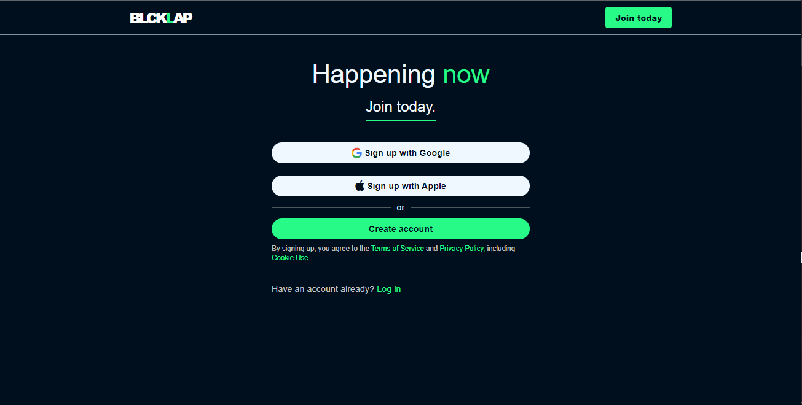
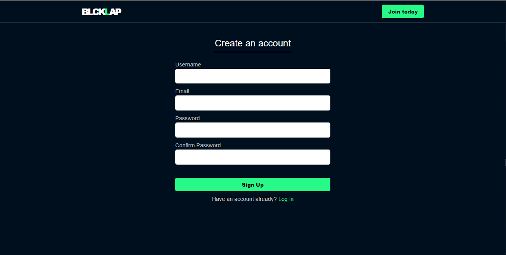
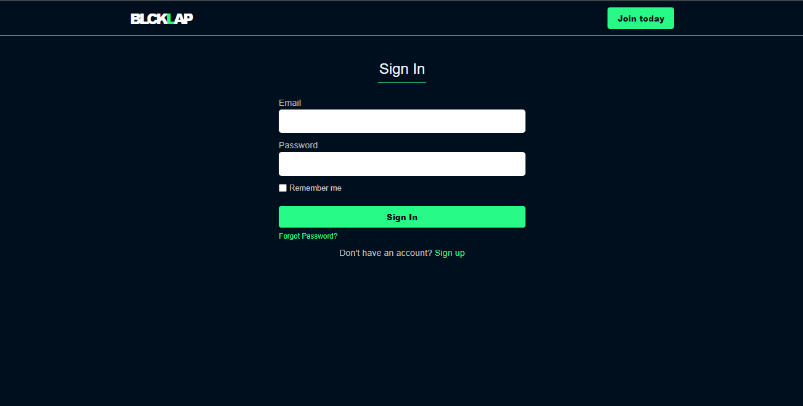
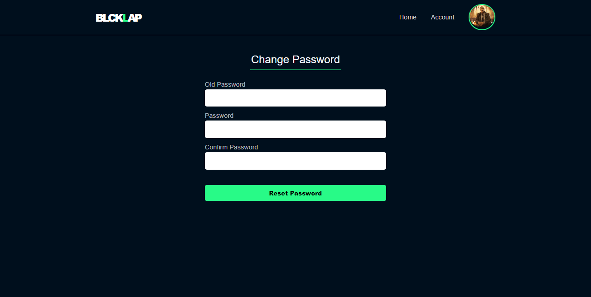

# BlckLap

    

[](https://github.com/surbd)

Blcklap is an Authentication project built with Flask. It comprises of basic login and actions and account management options.

## Features

- Registration, Login and Logout
- Protected Routes
- Account Verification
- Account Management (Profile update)
- Password Reset (Forgot Password)


## Installation

You would find required dependencies to run BlckLap on your local machine in the `requirements.txt` file.

Clone this Repo
```sh
git clone git@github.com:SurbD/BlckLap.git
```
Create a virtual environment and activate it (use `source venv\bin\activate` for mac)
```sh
python -m venv venv-name
venv\Scripts\activate
```
> Make sure you create the virtual environment is the project directory

Install the dependencies and start the server.

```sh
pip install -r requirements.txt
FLASK_APP=run.py
```
```
python run.py
```
> Environments variables like `BLCKLAP_SECRET_KEY`, `EMAIL_USER`
> and `EMAIL_PASS` others would have to be manually set

## BlckLap User Interface

##### Landing Page

##### Register Page

##### Login Page

##### Change Password
